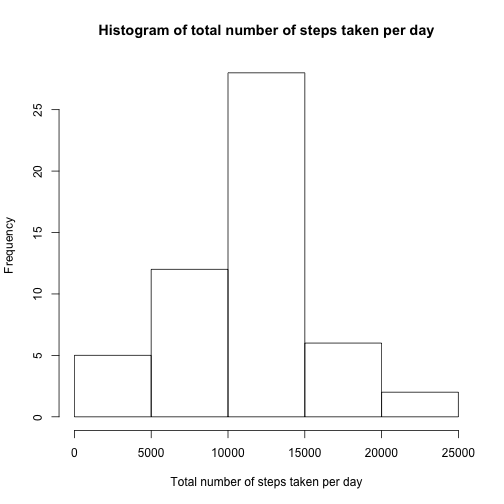
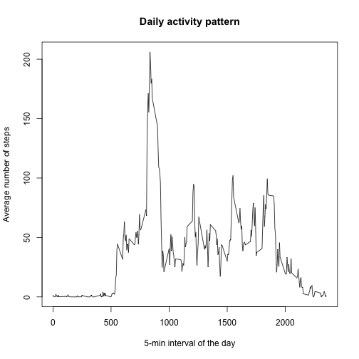
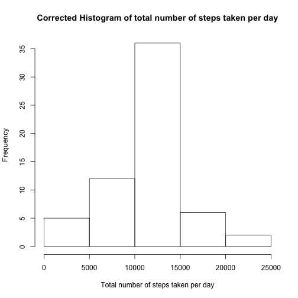
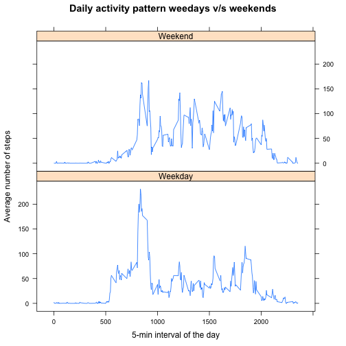

# Reproducible Research - Programming Assignment 1 #

This assignment uses data from Activity Monitoring Data that has been already downloaded into the GitHub where the assignment has been made available.

The variables included in this dataset are:

**steps**: Number of steps taking in a 5-minute interval (missing values are coded as NA)  
**date**: The date on which the measurement was taken in YYYY-MM-DD format  
**interval**: Identifier for the 5-minute interval in which measurement was taken

The dataset is stored in a comma-separated-value (CSV) file and there are a total of 17,568 observations in this dataset.

## Loading and preprocessing the data ##

Considering this, we just need to uncompress the activity.zip file and load the resulting activity.csv file into R.


```r
unzip("activity.zip")
activity <- read.csv("activity.csv", header = TRUE, sep = ",") 
```

## What is mean total number of steps taken per day? ##

We'll use the dplyr package.


```r
library(dplyr)
```

Then we'll group the records by date, to construct the histogram of total number of steps per day. 


```r
by_day <- group_by(activity, date)
steps_by_day <- summarize(by_day, sum(steps))
names(steps_by_day)[2] <- "sum"
hist(steps_by_day$sum, main = "Histogram of total number of steps taken per day", xlab = "Total number of steps taken per day")
```

 

Now we need to determine the mean and median for the total number of steps taken per day.


```r
mean_steps <- format(mean(steps_by_day$sum, na.rm = TRUE), digits = 0, scientific = FALSE)
median_steps <- format(median(steps_by_day$sum, na.rm = TRUE), digits = 0, scientific = FALSE)
```

Hence, the total number of steps taken per day is characterized by a mean of 10766 and median of 10765 steps per day.

##What is mean total number of steps taken per day?##

We use dplyr again to group the activity dataset by interval of measurement.


```r
by_interval <- group_by(activity, interval)
steps_by_interval <- summarize(by_interval, mean(steps, na.rm = TRUE))
names(steps_by_interval)[2] <- "mean"
plot(steps_by_interval, type="l", main = "Daily activity pattern", xlab = "5-min interval of the day", ylab = "Average number of steps")
```

 

Now, let's finf out which interval of the day has the maximum average number of steps.


```r
max_int <- which.max(steps_by_interval$mean)
max_int_time <- steps_by_interval[max_int,1]
max_mean_steps <- format(steps_by_interval[max_int,2], na.rm = TRUE, digits = 0, scientific = FALSE)
```

The interval 104 (at 835 hours) has a maximum average of 206 steps.

## Inputing missing values ##

Let's ckeck the number of missing values in the dataset.


```r
n_rows <- nrow(activity)
n_na <- sum(is.na(activity))
```

The dataset has 17568 records, from where 2304 have missing (NA) values.

Since the missing values usually concentrate in whole days, we choose to fill them with the mean of the interval for all the rest of the days. So, let$)C"%s create a "Mean Day" i.e. a set of 288 5-min intervals made up with the actual mean (this time rounded to the closest integer).


```r
mean_day <- mutate(steps_by_interval, mean = round(mean, digits = 0))
```

Then, for each NA value in the original activity table, we will replace with the corresponding mean for each interval.

But first let's split the original activity dataset between NAs and non-NAs.


```r
activity_na <- filter(activity, is.na(steps))
activity_non_na <- filter(activity, !is.na(steps))
```

For the NAs dataset we will join the data with the mean_day, and then we'll rearrange the new records.


```r
activity_na <- left_join(activity_na, mean_day, by = "interval") %>%
                select(mean, date, interval)
names(activity_na)[1] <- "steps"
```

Then we'll rejoin the former NA and non-NA records, and we'll order them per date and interval.


```r
activity_2 <- bind_rows(activity_na, activity_non_na) %>% 
                 arrange(date, interval)
```

Now let's see how the histogram has changed.


```r
by_day <- group_by(activity_2, date)
steps_by_day <- summarize(by_day, sum(steps))
names(steps_by_day)[2] <- "sum"
hist(steps_by_day$sum, main = "Corrected Histogram of total number of steps taken per day", xlab = "Total number of steps taken per day")
```

 

And see the new mean and median for the total number of steps taken per day.


```r
mean_steps <- format(mean(steps_by_day$sum, na.rm = TRUE), digits = 0, scientific = FALSE)
median_steps <- format(median(steps_by_day$sum, na.rm = TRUE), digits = 0, scientific = FALSE)
```

The new total number of steps taken per day is characterized by a mean of 10766 and median of 10762 steps per day.

Comparing the histograms we can see an increase in the most common range (10,000 to 15,000) from 27 to 35 aproximately. This sound reasonable since we are evaluating more samples.

The mean was kept in 10766, but the median decreased from 10765 to 10762. This is actually more accurate since before the median didn't consider 2304 out of 17568 missing records, approximately 13%.

## Are there differences in activity patterns between weekdays and weekends? ##

We now need to analyze how the behavior of the average number of steps taken changes between weekdays and weekends.

Let's create a new dataset adding a new "weekday" column.


```r
activity_3 <- mutate(activity_2, weekday = !(weekdays(as.Date(date), abbreviate = TRUE) %in% c("Sat", "Sun")))
```

We'll split the activity_3 file to later compute the mean by intervals in each group (different files).


```r
activity_wday <- filter(activity_3, weekday == TRUE)
activity_wend <- filter(activity_3, weekday == FALSE)

by_interval <- group_by(activity_wday, interval)
wday_by_interval <- summarize(by_interval, mean(steps))
names(wday_by_interval)[2] <- "mean"

by_interval <- group_by(activity_wend, interval)
wend_by_interval <- summarize(by_interval, mean(steps))
names(wend_by_interval)[2] <- "mean"
```

Noe we re-join into a single file (add weekday column again, since it was lost in the previous process).


```r
wday_by_interval <- mutate(wday_by_interval, weekday = "Weekday")
wend_by_interval <- mutate(wend_by_interval, weekday = "Weekend")
steps_by_wday_interval <- bind_rows(wday_by_interval, wend_by_interval)
```

Finally make the new plot. 


```r
library(lattice)
xyplot(mean ~ interval | weekday, data = steps_by_wday_interval, type = "l", layout = c(1, 2), main = "Daily activity pattern weedays v/s weekends", xlab = "5-min interval of the day", ylab = "Average number of steps") 
```

 

You can see there is more walking activity on weekends. But the most intense period (more steps) happens on weekdays, probably on the way to work.
